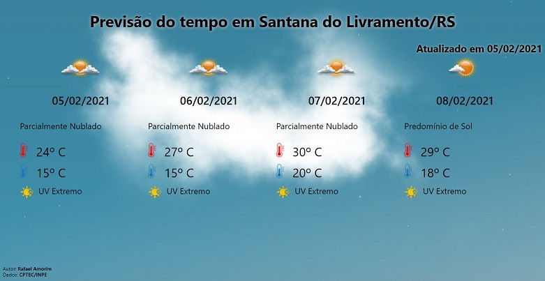

# TempoCPTEC
Serviço em PHP para exibição da previsão do tempo em cidades brasileiras, utilizando dados do CPTEC/INPE

**Demo: https://www.rafaelamorim.com.br/tempo**

## Como utilizar

O serviço permite algumas personalizações, que devem ser passadas na URL. As variáveis são:
* **cidade**:  Código que pode ser obtito em http://servicos.cptec.inpe.br/XML/listaCidades  (para principais cidades) ou ainda este código pode ser localizado via url  http://servicos.cptec.inpe.br/XML/listaCidades?city=santana%20do%20livramento. Caso não seja informado um código de cidade, o código utilizará o código 4679 (minha cidade atual, Santana do Livramento/RS) para fins de demonstração do script
* **modo**: Quantidade de dias de previsão a ser exibido. Valores aceitáveis são  1 (4 dias de previsão) ou 2 (7 dias de previsão). Qualquer outro valor informado irá gerar uma mensagem de erro.
* **estilo**: Nome do CSS que deve ser utilizado para dar a formatação a página. Não é ncessário a extensão **".CSS"**. Caso não seja informado um, será carregado o arquivo estilo.css.

**Demo com todos os parâmetros ativados: https://www.rafaelamorim.com.br/tempo/?cidade=237&modo=1&estilo=estilo**

## Requisitos

* PHP 7 (não testado em versões anteriores, mas deve funcionar)
* Biblioteca SimpleXML

## Créditos

* Dados CPTEC/INPE: http://servicos.cptec.inpe.br/XML/
* Imagens 
  - Situação do tempo: CPTEC/INPE (https://s0.cptec.inpe.br/webcptec/common/assets/images/icones/)
  - Índice do tempo: VectorStock
  - Termômetro: PNG Find e mais algum tempo no GIMP, para personalização das imagens.
  - Background: https://www.nephele.cloud/ e mais algum tempo no GIMP.